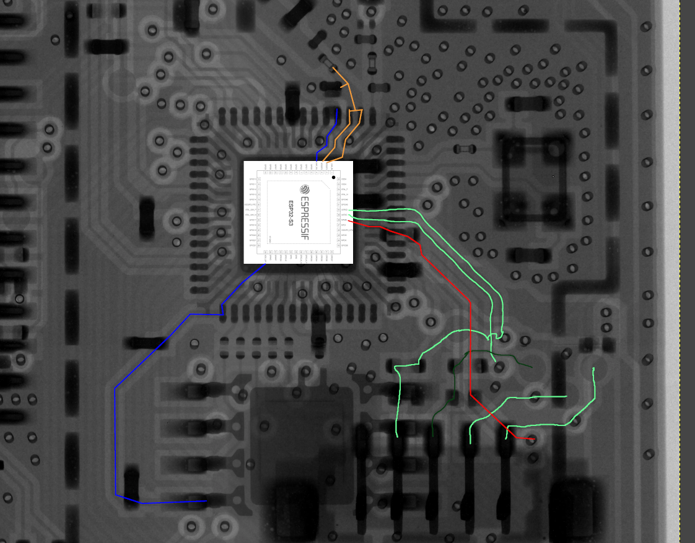

# Bambu P1S Hacking

This is a collection of files/resources to investigate the firmware on the Bambu Labs P1S.

## Scan

The AB Board, which contains the ESP32-S3 SOC has been X-ray scanned and can be found in [AB-board-esp32-scan.webp](./AP-board-esp32-scan.webp)

## Firmware

The board I used to dump the firmware seems to have a flaky flash chip. Each read would have a few different bits flipped. To rectify this i took 20+ dumps and used [bin-voter](https://github.com/lanrat/bin-voter) to generate a corrected [flash_dump.bin](./flash_dump.bin).

Looking over the firmware, the flash dumps do not have the normal partition table layout. I suspect the main firmware is encrypted. However there are some plain-text logs from part prints included in the dump.

The entropy for the dumped firmware can be found in [flash_entropy.png](./flash_entropy.png).

From here you can see the offsets from the various partitions on the flash.

## PCB Traces

I have started the process of tracing out important signals such as UART on the PCB. A preview can be found in [pcb_traces_wip.png](pcb_traces_wip.png).

The more detailed version is in [pcb.xcf.gz](pcb.xcf.gz).

So far it seems that the unused connector directly behind the ESP32 is for UART. It has UART0 RX/TX/Gnd, and some other TBD connectors.

Next is to find the right pins and voltage to externally power this board and watch for UART messages.

